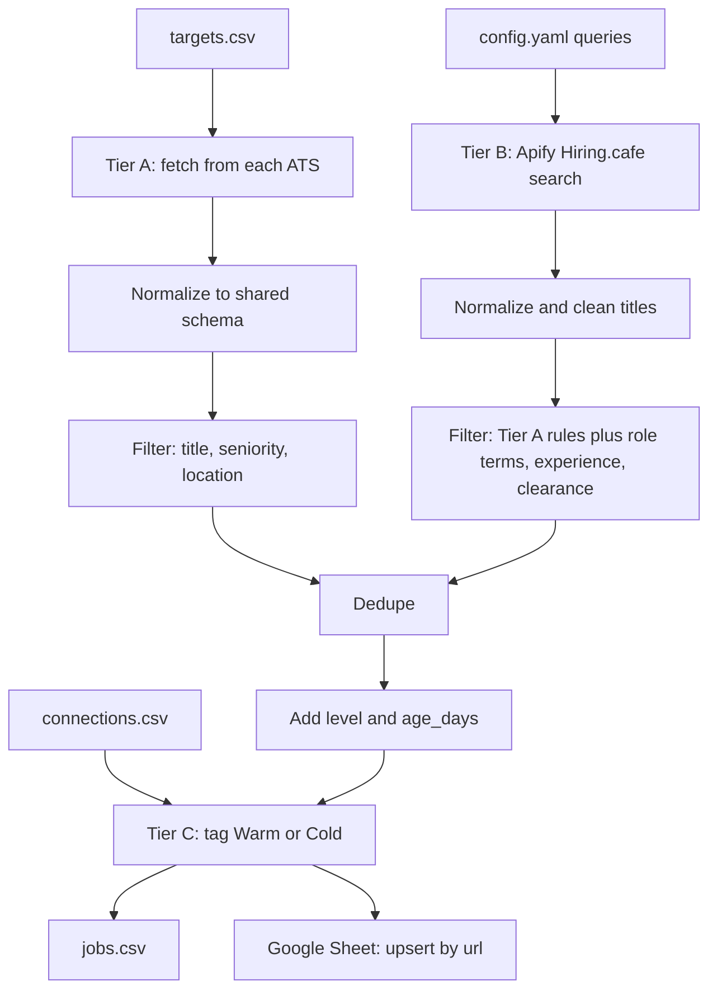

# Get Hired pipeline

A daily job that pulls relevant UK AI and ML engineering roles into a Google Sheet and tags each one Warm (you know someone at the company) or Cold.

## Overview

The pipeline has three tiers:

- **Tier A, company career pages.** Reads `targets.csv` and fetches every open role straight from each company's applicant tracking system (ATS). Free and exact.
- **Tier B, market search.** Runs an Apify actor that searches Hiring.cafe for UK roles at companies you have not listed. Costs a few pence per run and can be switched off.
- **Tier C, connections.** Matches each job's company against your LinkedIn connections export and tags it Warm or Cold.

Jobs are filtered by title, seniority and location, de-duplicated, then upserted into the "Jobs" tab of your sheet. Columns you add to the sheet yourself (notes, status) are never touched.

## Architecture



## Repo structure

```
get-hired-pipeline/
├── config.yaml              # filters, levels, Tier B settings, connection matching
├── targets.csv              # Company,ATS,Slug,Careers URL
├── connections.csv          # your LinkedIn export (gitignored, optional)
├── main.py                  # entry point
├── pipeline/
│   ├── fetchers.py          # one fetch function per ATS, plus ATS detection
│   ├── normalize.py         # map each ATS response to the shared schema
│   ├── filters.py           # title, seniority and location rules
│   ├── market.py            # Tier B: Apify Hiring.cafe search
│   ├── dedupe.py            # drop repeats
│   ├── enrich.py            # level and age_days
│   ├── connections.py       # Tier C: Warm/Cold matching
│   └── sheets.py            # Google Sheets upsert
├── tests/
│   └── fixtures/            # saved real API responses, one per source
└── .github/workflows/daily.yml
```

Every job from every source is mapped to the same fields: `company, ats, title, location, url, posted, ext_id`.

The sheet columns are:

| Column | Meaning |
|---|---|
| company, ats, title, location, url, posted, ext_id | the shared fields above |
| level | intern, graduate, junior, mid or senior |
| age_days | days since `posted`, refreshed every run |
| min_yoe, salary_min, salary_max, salary_currency, clearance | Tier B only, blank when the listing does not say |
| lead_type, connection, connection_title | Warm or Cold, and who you know there |
| first_seen, last_seen | date the pipeline first and most recently saw the job |

A job that disappears from a company's board keeps its row. Its `last_seen` simply stops moving, which tells you it has closed.

## Setup

Requires Python 3.11.

```powershell
git clone https://github.com/<you>/get-hired-pipeline.git
cd get-hired-pipeline
python -m venv .venv
.venv\Scripts\Activate.ps1
pip install -r requirements.txt
```

On macOS or Linux, activate with `source .venv/bin/activate`.

### 1. Google service account

The pipeline writes to your sheet as a service account, which is a robot Google account with its own email address.

1. Go to https://console.cloud.google.com and create a project (any name).
2. Open "APIs & Services", then "Library". Search for **Google Sheets API** and click Enable.
3. Open "IAM & Admin", then "Service Accounts". Click "Create service account", give it a name and click Done. You can skip the optional role steps.
4. Click the new service account, open the "Keys" tab, then "Add key", "Create new key", JSON. A key file downloads. Store it outside this repo.
5. Copy the service account's email address. It ends in `iam.gserviceaccount.com`.

### 2. Share the sheet with the service account

1. Create a Google Sheet, or open the one you want to use.
2. Click Share, paste the service account email and give it Editor access.
3. Copy the sheet ID from the URL. It is the long string between `/d/` and `/edit`.

You do not need to create the "Jobs" tab or any headers. The first run does both.

### 3. Environment variables

| Variable | Used for | Notes |
|---|---|---|
| `SHEET_ID` | Google Sheets | the ID from step 2 |
| `GOOGLE_SERVICE_ACCOUNT_FILE` | Google Sheets, local runs | path to the key file |
| `GOOGLE_SERVICE_ACCOUNT_JSON` | Google Sheets, GitHub Actions | the full contents of the key file. Used when the file variable is not set |
| `APIFY_TOKEN` | Tier B | from https://console.apify.com/settings/integrations. Without it Tier B is skipped |

In PowerShell, for the current session:

```powershell
$env:SHEET_ID = "your-sheet-id"
$env:GOOGLE_SERVICE_ACCOUNT_FILE = "C:\path\to\key.json"
$env:APIFY_TOKEN = "your-apify-token"
```

The pipeline never prints or logs any of these values.

### 4. GitHub secrets

In your GitHub repo open "Settings", "Secrets and variables", "Actions" and add:

| Secret | Value |
|---|---|
| `SHEET_ID` | the sheet ID |
| `GOOGLE_SERVICE_ACCOUNT_JSON` | open the key file in a text editor and paste the whole thing |
| `APIFY_TOKEN` | your Apify token. Leave it out to run Tier A only |
| `CONNECTIONS_CSV` | optional, see below |

`connections.csv` is not committed, so GitHub Actions cannot see it. Without the `CONNECTIONS_CSV` secret the daily run tags every job Cold and overwrites the Warm tags from your local runs. To keep Warm tags in the daily run:

```powershell
python -m pipeline.connections
```

This writes `connections.slim.csv` with only the four columns the pipeline reads (first name, last name, company, position). Paste its contents into the `CONNECTIONS_CSV` secret. GitHub secrets hold up to 48 KB and the command prints the file size.

The workflow in `.github/workflows/daily.yml` runs at 07:00 UK time every day and can also be started by hand from the Actions tab ("Run workflow"). It runs the tests first, then the pipeline, and uploads `jobs.csv` as an artifact.

### 5. Connections (optional)

1. In LinkedIn open "Settings & Privacy", "Data privacy", "Get a copy of your data".
2. Tick "Connections" only and request the archive. It arrives by email within a few minutes.
3. Save `Connections.csv` from the archive as `connections.csv` in the repo root.

If the file is missing, every job is tagged Cold and the run says so.

Company names are compared after removing the words in `connections.ignore_words` in `config.yaml` (ltd, inc, ai, bank and so on). The match is exact, so "Cleo AI Ltd" matches "Cleo" but "Cleopatra" does not. If a company you know people at shows as Cold, check how LinkedIn spells the company and add the extra word to that list.

## Running locally

```powershell
python main.py
```

This fetches all tiers, writes `jobs.csv` and upserts the sheet. Expect output like:

```
INFO Tier A: kept 63 of 435 jobs after filters
INFO Tier B: kept 18 of 24 jobs after filters
INFO Dedupe: 80 jobs, 1 repeats dropped
INFO Tier C: 12 Warm, 68 Cold
INFO Sheets: 80 new rows, 0 updated
```

Run the tests with:

```powershell
python -m pytest -q
```

The tests use saved responses in `tests/fixtures/` and make no network calls.

## Running with --dry-run

```powershell
python main.py --dry-run
python main.py --dry-run --company Cleo
```

`--dry-run` prints the jobs and writes `jobs.csv` without touching Google Sheets, so it needs no Google credentials. `--company` limits the run to one row of `targets.csv` and skips Tier B, which is the quickest way to check a new company.

## Adding a company to targets.csv

Add one row:

```
Company,ATS,Slug,Careers URL
Acme,ashby,acme,
```

Supported ATS values and where to find the slug:

| ATS | Slug is the part shown as `{slug}` |
|---|---|
| `greenhouse` | `job-boards.greenhouse.io/{slug}` |
| `greenhouse-eu` | `job-boards.eu.greenhouse.io/{slug}` |
| `lever` | `jobs.lever.co/{slug}` |
| `ashby` | `jobs.ashbyhq.com/{slug}` |
| `workable` | `apply.workable.com/{slug}` |
| `recruitee` | `{slug}.recruitee.com` |
| `smartrecruiters` | `jobs.smartrecruiters.com/{slug}` |
| `bamboohr` | `{slug}.bamboohr.com/careers` |

If you do not know the ATS, leave ATS and Slug blank and fill in the Careers URL. The pipeline looks at the URL, where it redirects to, and the links on the page:

```
Acme,,,https://acme.com/careers
```

Then check it:

```powershell
python main.py --dry-run --company Acme
```

If the log says "no supported ATS found", the company uses something else (Workday, Teamtailor, its own site) and cannot be added yet.

Two things to watch for:

- A slug can belong to a different company with a similar name. Check that the jobs printed are the ones you expect.
- Companies change ATS. If a company that used to work starts failing with a 404, find its new board and update the row.

## Tuning the filters

Everything is in `config.yaml`:

- `filters.title_must_contain`, `title_exclude_seniority`, `title_exclude_roles`: which titles are kept. Terms match whole words, so "ai" does not match "maintain".
- `filters.locations`: `uk` terms always pass. `broad` terms (remote, europe, emea) pass unless the location also names something in `exclude`, so "Remote" passes and "Remote - USA" does not.
- `filters.tiers`: Tier B must also contain one of `role_terms`. Tier A does not, because every company in `targets.csv` is already relevant.
- `levels`: the title keywords behind the `level` column.
- `market`: Tier B search queries, country, seniority, how recent, results per query, the experience limit (`max_min_yoe`) and `exclude_active_clearance`. Set `enabled: false` to run without Apify.

## Troubleshooting

| Symptom | Cause and fix |
|---|---|
| `WARNING <Company> failed, skipping: ... 404 Not Found` | Wrong slug, or the company moved ATS. The run carries on without it. Fix the row in `targets.csv`. |
| `WARNING <Company> failed, skipping: no supported ATS found` | The careers page does not link to a supported ATS. |
| A company shows `0 jobs fetched` | Its board is empty right now, or the slug belongs to an empty board. Open the board in a browser to check. |
| `Sheets update failed: set GOOGLE_SERVICE_ACCOUNT_FILE or GOOGLE_SERVICE_ACCOUNT_JSON` | Neither variable is set in this terminal session. |
| `Sheets update failed: could not load credentials from ...` | The path is wrong, or the JSON was pasted incompletely. The message never shows the key itself. |
| `Sheets update failed` with a 403 or `PermissionError` | The sheet is not shared with the service account email, or the Sheets API is not enabled in the Google Cloud project. |
| `Sheets update failed` with a 404 | `SHEET_ID` is wrong. Use only the part between `/d/` and `/edit`. |
| `Tier B: skipped, APIFY_TOKEN is not set` | Expected if you have no token. Tier A still runs. |
| `Tier B: '<query>' failed` with 401 or 402 | The token is wrong, or the Apify account is out of credit. |
| Tier B returns jobs but few are kept | Normal. The role, experience and clearance rules are strict. Loosen them in `config.yaml`. |
| Everything is tagged Cold | `connections.csv` is missing, or in GitHub Actions the `CONNECTIONS_CSV` secret is not set. |
| A company you know people at is Cold | LinkedIn spells the company differently. Add the extra word to `connections.ignore_words`. |
| The scheduled run did not start | GitHub can delay scheduled runs at busy times and pauses schedules after 60 days without repo activity. Start it by hand from the Actions tab. |
| Rows I sorted or edited by hand | Safe. The pipeline finds rows by `url` and columns by header name. Do not rename the pipeline's own column headers. |

## Git push instructions

First push of a new local folder:

```powershell
git init -b main
git add .
git status
```

Check the `git status` list before committing. `connections.csv`, `jobs.csv`, `.venv/` and any key file must not appear in it.

```powershell
git commit -m "Get Hired pipeline"
```

Create an empty repo on GitHub (no README, no .gitignore), then:

```powershell
git remote add origin https://github.com/<you>/get-hired-pipeline.git
git push -u origin main
```

Make the repo private if you would rather not publish your target list. After pushing, add the secrets from the setup section and start the workflow once from the Actions tab to confirm it works.

Later changes:

```powershell
git add .
git commit -m "Describe the change"
git push
```
